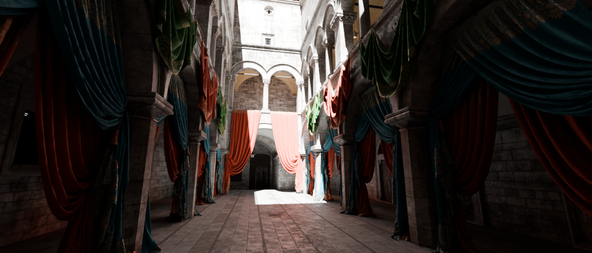
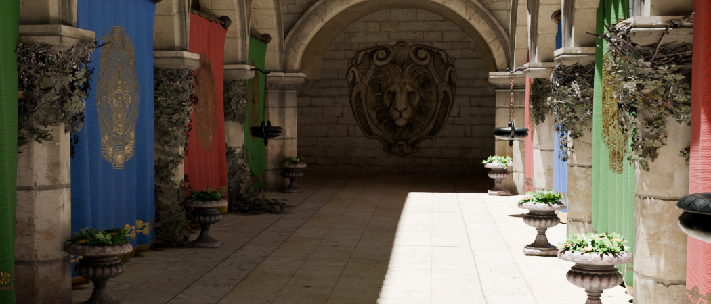

Scenes
===
Collection of various public domain 3D scenes authored in Blender 5.0+.

Textures, if not otherwise mentioned, are packed into the .blend files. You may download any of these scenes in the [Releases](https://github.com/mos9527/Scenes/releases) section.

## [Intel® GPU Research Samples - Sponza](https://github.com/mos9527/Scenes/releases/tag/intel-sponza)

**Stats:** 3,094,896 vertices, 5,744,370 triangles.

This is a combination of the base Sponza atrium model and the following 'Add-on' packages:
- Colorful Curtains

Sourced from:
- https://www.intel.com/content/www/us/en/developer/topic-technology/graphics-research/samples.html

Preview rendered in Blender 5.0.0 with Cycles.

## [glTF Sample Models - Sponza](https://github.com/mos9527/Scenes/releases/tag/gltf-sponza)

**Stats:** 192,496 vertices, 262,267 triangles.

*Much* lighter version of the previous Sponza model.

Sourced from https://github.com/KhronosGroup/glTF-Sample-Assets

Preview rendered in Blender 5.0.0 with Cycles.

---

Copyright reserved by their respective owners. Copyleft 2025, mos9527.
